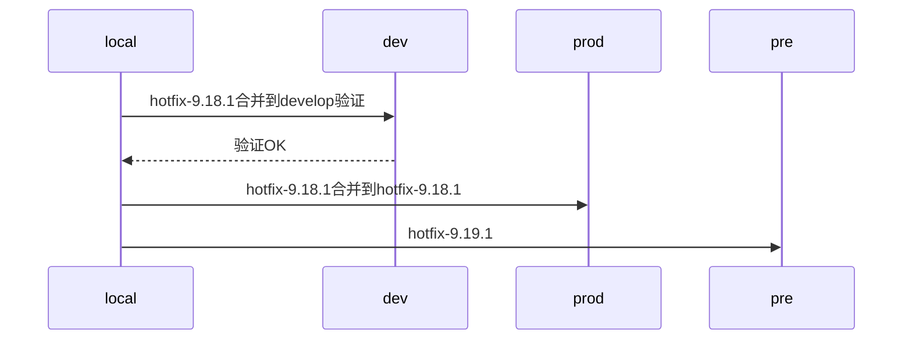
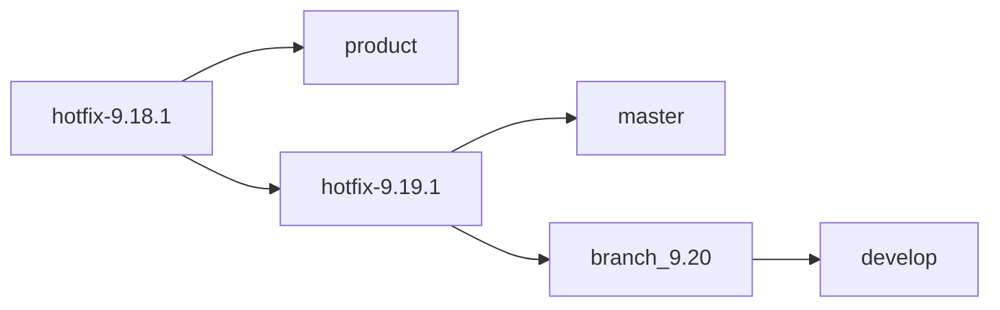

git仓库分支管理
------

[TOC]

## 模块介绍
|module|desc|
|-|-|
|日常合并|每日hotfix|
|版本发布|灰度发布和上线发布|

## useage
### 日常合并

生产hotfix
```
python ./日常合并/daily.py prod
```

流程如下
#### 生产修复


合代码过程



### 版本发布

#### 灰度发布

#### 上线发布